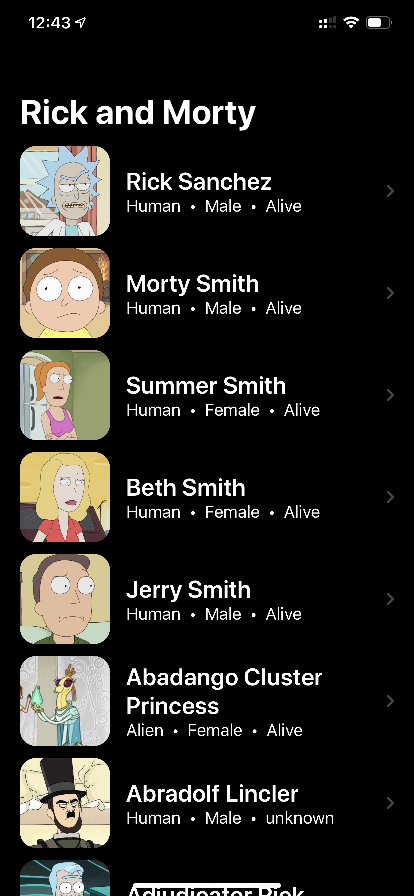
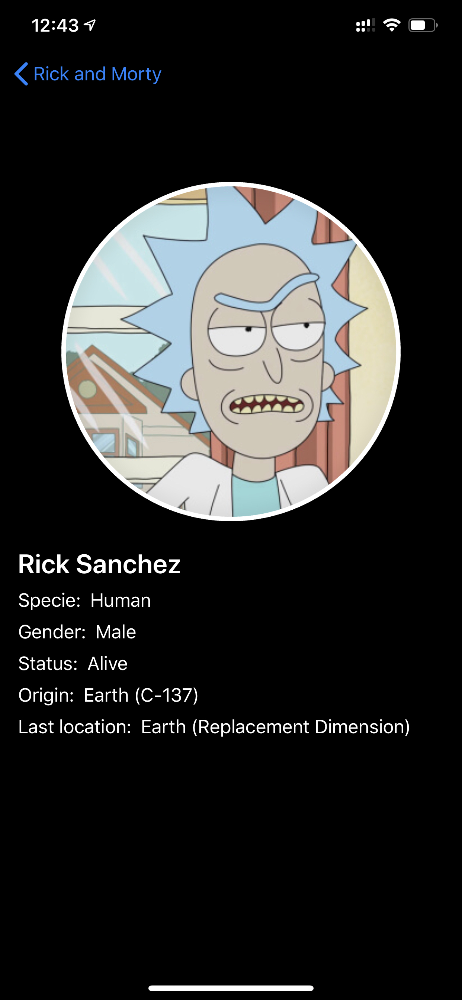

# Swift Apollo Client

[](https://github.com/victorshinya/swift-apollo-client/blob/master/LICENSE)
[](https://github.com/victorshinya/swift-apollo-client/pulls)

An [Apollo Client (iOS)](https://www.apollographql.com/docs/ios/) application built with SwiftUI and [The Rick and Morty API](https://rickandmortyapi.com). Apollo is an implementation of GraphQL that creates a communication layer between your client (such as React and iOS apps) to your back-end services.

<div align="center">
    
    
</div>

## Run locally

As the project uses [Cocoapods](https://cocoapods.org) for Dependency Management for Swift and Objective-C, you need to run the code below in order to create `Swift\ Apollo\ Client.xcworkspace`. That's the file you are going to use.

```sh
pod install
```

## LICENSE

MIT License

Copyright (c) 2020 Victor Shinya
