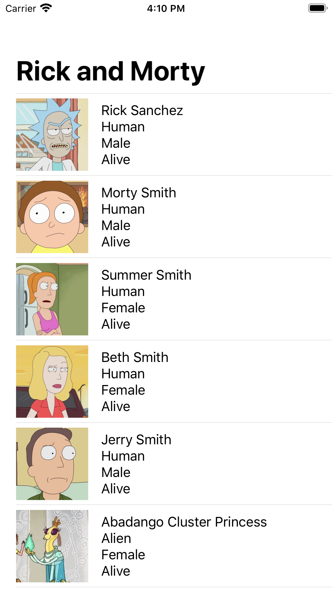

# Swift Apollo Client

An [Apollo Client (iOS)](https://www.apollographql.com/docs/ios/) application built with SwiftUI and [The Rick and Morty API](https://rickandmortyapi.com). Apollo is an implementation of GraphQL that creates a communication layer between your client (suc as React and iOS apps) to your back-end services.

    

## LICENSE

MIT License

Copyright (c) 2019 Victor Shinya
